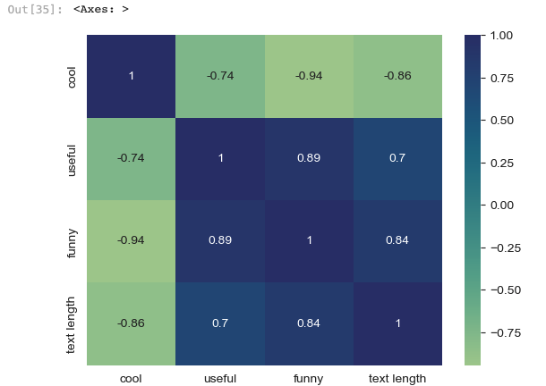
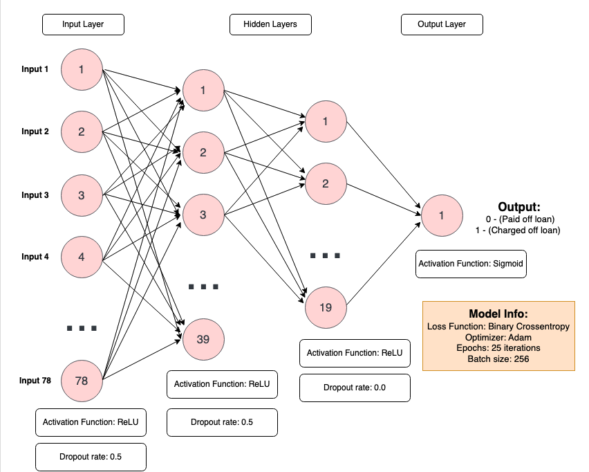
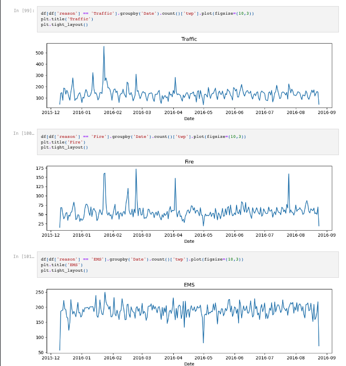
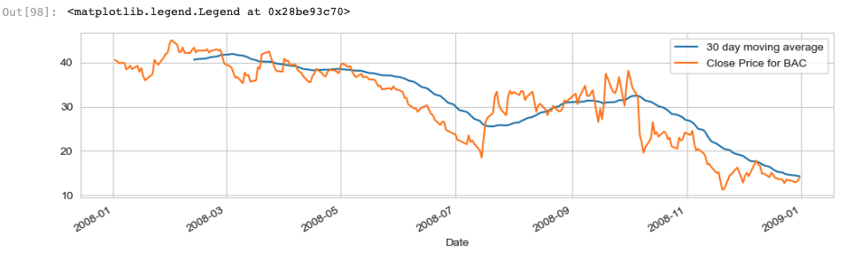

# Krish Chanda Project Portfolio
Welcome to my GitHub repository, an immersive showcase of my passion for coding and problem-solving! Here, you will find a diverse range of projects that demonstrate my skills and expertise in various programming languages, including Python, C++, Java, and MySQL. My repository is divided by languages/frameworks and project files & summaries can be found within each section. 

Below is an overview of my projects using different languages and frameworks.

## JavaScript, CSS, React Native, Google Firebase
Here you can find the collaborative [ACM Project](https://github.com/acm-projects/Shop-and-Share) where I worked with a team of 5 students. I worked as a Full-Stack Developer but my main accomplishments lie in the backend development I did for our shopping list app. 

### My Accomplishments:
o	Built user authentication using Google Firebase
o	Created a relational database of 6 tables to store user shopping information using Cloud Firestore  
o	Integrated React local Push-Notifications using JavaScript & CSS 

Shop&Share is an app that allows a user to create and share grocery lists with others while keeping track of allergies and preferences of the people sharing the list while reminding you of items in your pantry nearing expiration! 

### App Demo
https://github.com/krishChanda/Krish-Chanda-Project-Portfolio/assets/72318969/2a751c80-64af-4fd0-91f1-21ebb7b07cc0

## Python Machine Learning Project Preview

Using Python, I have leveraged the power of various libraries (NumPy, Pandas, Matplotlib, Seaborn, Plotly, Sklearn, TensorFlow, Keras) to conduct exploratory data analysis and build Machine Learning algorithms. Preview of Projects shown below: 

### Natural Language Processing (NLP) Project: 
Given a dataset of Yelp reviews from [Kaggle](https://www.kaggle.com/c/yelp-recsys-2013), I implemented an NLP model using the Python sklearn library in order to determine based on a review, whether it was positive (5-star) or negative (1-star).
### Correlation Map of data

### Project Overview
* Graph distributions of each Yelp review by stars (1-5) and text length
* Find if any strong correlations lie in the data using a heatmap
* Separate the data into train/test splits & use CountVectorizer() function to remove any stopwords from the reviews
* Implement and train a Pipeline model that uses a MultinomialNB classifier and Tf-idf transformer
* Create a classification report & confusion matrix to determine the accuracy of the model

### Recurrent Neural Net (RNN) Project:
Given a dataset from Kaggle for [loan details](https://www.kaggle.com/wordsforthewise/lending-club), I use exploratory data analysis, data pre-processing, and an RNN model using TensorFlow to determine if a person would be able to pay off a loan (loan_status column) given other factors.
### Training Model Diagram:

### Project Overview:
* Use scatterplots, count-plots,  and heatmaps to find correlations within the dataset
* Analyze missing data and either normalize or delete them based on correlations with non-empty cols
* Create dummy variables for the remaining columns for the training algorithm
* Drop columns that give no useful information
* Separate data into train/test splits and create scale the data using a MinMaxScaler() function
* Use Tensorflow to create a Recurrent Neural Network model
* Fit the model with the train data and make predictions using test split & plot model history performance
* Create a classification report & confusion matrix to determine the accuracy of the model

## Python Data Analysis Project Preview

In these two capstone projects, I use real-world datasets to conduct exploratory data analysis using Python tools and libraries.

### 911 Calls Data Project:
Using a dataset of 911 call records from Kraggle, I compare the different types of emergencies as well as the date(by month & year) in order to graph the information to get a better understanding of 911 call history and trends in the dataset.

### Frequency Table of Different Types of Emergencies

### Finance Project:
In this data project, I focused on exploratory data analysis of stock prices of various banks in the past decade in order to:
* Map distribution returns of the bank (analysis of stock volatility) 
* Calculate the 30-day moving average and compare it to the actual stock price using a line plot
* Create HeapMaps to determine if any correlations exist between each bank stock

### 30 Day Moving Average Table

## CPP Projects:

In these sets of programs, I use my knowledge of C++ to create programs that implement and use C++ data structures(search & sort algorithms) and familiarize myself with Object-Oriented Programming, and file management/access.

## Java Projects:
In the following programs, I used my knowledge of Java to create programs that showcase my understanding of class structure organization and advanced data structures (LinkedList, Hashmap, and Hashset).

## MySQL
In the following project, I utilize my knowledge of MySQL to create a mock database for a social media site and used SQL querying procedures such as foreign keys, subqueries, joins, and group-by to conduct exploratory data analysis.  
